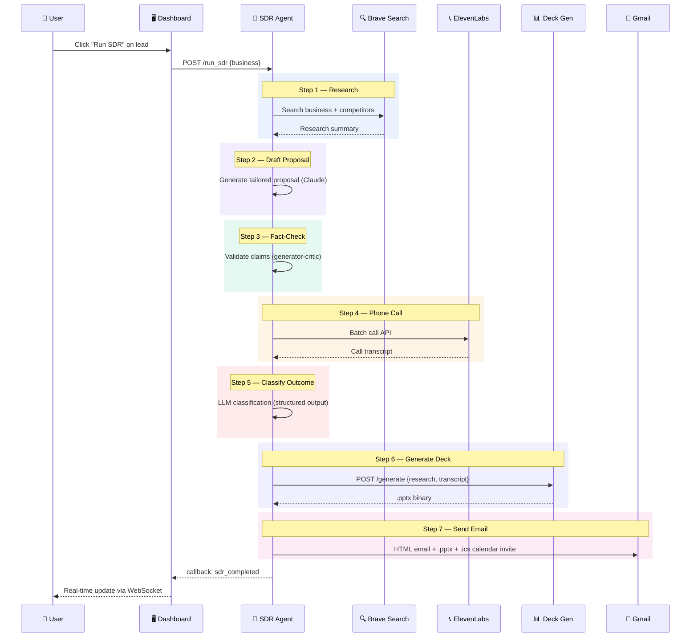
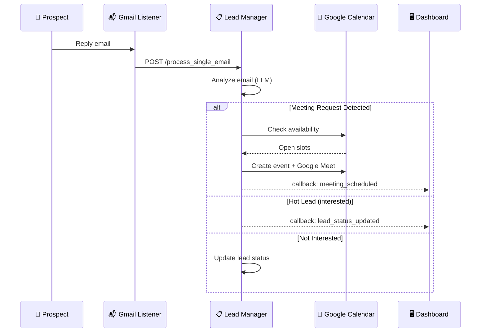
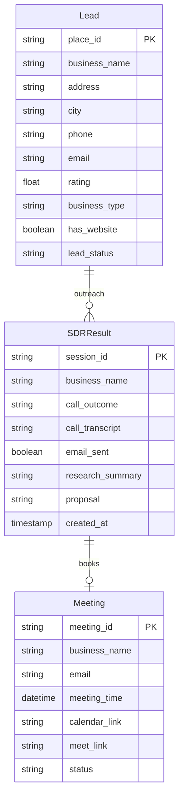

# ⚡ RapidReach — AI-Powered SDR Agent System

> **Find. Research. Call. Close.** — A multi-agent system that automates the entire sales development lifecycle, from lead discovery to meeting booking.

Built with [Dedalus ADK](https://docs.dedaluslabs.ai) at **Columbia ADI DevFest 2026**.

---

## 📋 Table of Contents

- [What It Does](#-what-it-does)
- [System Architecture](#-system-architecture)
- [Agent Workflow](#-agent-workflow)
- [Key Features](#-key-features)
- [Tech Stack](#-tech-stack)
- [Project Structure](#-project-structure)
- [Quick Start](#-quick-start)
- [Environment Configuration](#-environment-configuration)
- [API Reference](#-api-reference)
- [How the AI Works](#-how-the-ai-works)
- [Design Patterns](#-design-patterns)
- [Limitations](#-limitations)
- [License](#-license)

---

## 🎯 What It Does

RapidReach is a **fully autonomous SDR (Sales Development Representative)** that replaces the manual grind of prospecting with an intelligent multi-agent pipeline:

```
  🔍 DISCOVER          🧠 RESEARCH          📞 CALL             📧 EMAIL            📅 BOOK
  ┌─────────┐         ┌─────────┐         ┌─────────┐         ┌─────────┐         ┌─────────┐
  │  Google  │────────▶│  Web    │────────▶│  AI     │────────▶│ Custom  │────────▶│  Auto   │
  │  Maps    │         │  Search │         │  Voice  │         │ Proposal│         │ Schedule│
  │  Search  │         │  + LLM  │         │  Call   │         │ + Deck  │         │ Meeting │
  └─────────┘         └─────────┘         └─────────┘         └─────────┘         └─────────┘
  Find businesses      Deep-research       ElevenLabs          HTML email +        Gmail reply
  without websites     pain points &       conversational      PowerPoint deck     → Calendar
  in any city          opportunities       AI phone call       via Gmail API       + Google Meet
```

| Step | Agent | What Happens |
|:----:|-------|-------------|
| **1** | Lead Finder | Searches Google Maps for local businesses **without websites** in a target city |
| **2** | SDR → Research | Deep-researches each business via Brave Search MCP — reviews, competitors, pain points |
| **3** | SDR → Proposal | Generates a tailored website proposal (draft + fact-check with generator-critic pattern) |
| **4** | SDR → Call | Places an **AI phone call** via ElevenLabs Conversational AI |
| **5** | SDR → Classify | LLM classifies call outcome: `interested` / `agreed_to_email` / `not_interested` |
| **6** | SDR → Email | Sends branded HTML proposal email with professional **PowerPoint deck** attached |
| **7** | Gmail Listener | Watches inbox via Pub/Sub (or polling fallback) for prospect replies |
| **8** | Lead Manager | Detects meeting requests → checks calendar → books **Google Calendar + Meet** |

---

## 🏗️ System Architecture

### High-Level Service Map

```mermaid
graph TB
    subgraph "🖥️ Frontend — Dashboard"
        UI["🖥️ UI Client<br/>FastAPI + Jinja2<br/>:8000"]
        WS["🔌 WebSocket<br/>Real-time Events"]
        JS["📱 Vanilla JS<br/>Dark Theme UI"]
    end

    subgraph "🔍 Lead Discovery Engine"
        LF["🔍 Lead Finder<br/>Agent Service<br/>:8081"]
        DEDUP["🔄 Smart Dedup<br/>Merge Engine"]
    end

    subgraph "🧠 SDR Outreach Pipeline"
        SDR["🧠 SDR Agent<br/>Coordinator<br/>:8084"]
        RESEARCH["📚 Research<br/>Specialist"]
        DRAFT["✍️ Proposal<br/>Writer"]
        FACTCHECK["✅ Fact-Check<br/>Validator"]
        CLASSIFY["🏷️ Call Outcome<br/>Classifier"]
    end

    subgraph "📊 Deck Generation"
        DG["📊 Deck Generator<br/>python-pptx<br/>:8086"]
        PPTX["📄 .pptx Builder<br/>Slide Templates"]
    end

    subgraph "📬 Inbound Email Processing"
        GL["📬 Gmail Listener<br/>:8083"]
        LM["📋 Lead Manager<br/>:8082"]
        EMAILAI["🤖 Email Analyzer<br/>Intent Detection"]
    end

    subgraph "☁️ Google Cloud Platform"
        MAPS["🗺️ Google Maps<br/>Places API"]
        BQ["💾 BigQuery<br/>Data Warehouse"]
        GMAIL_SEND["📧 Gmail API<br/>MIME + Attachments"]
        GMAIL_READ["📥 Gmail API<br/>Read + Mark"]
        GCAL["📅 Google Calendar<br/>API"]
        GMEET["🎥 Google Meet<br/>Video Links"]
        PUBSUB["📡 Cloud Pub/Sub<br/>Push Notifications"]
        OAUTH["🔐 OAuth2 / Service<br/>Account Auth"]
    end

    subgraph "🤖 Dedalus Labs — AI Orchestration"
        DEDALUS["⚡ Dedalus ADK<br/>DedalusRunner"]
        GPT["🧠 OpenAI GPT-4.1<br/>Research + Classify"]
        CLAUDE["✨ Anthropic Claude<br/>Sonnet 4 — Drafting"]
        PYDANTIC["📋 Pydantic v2<br/>Structured Outputs"]
    end

    subgraph "🔍 Brave Software — Web Search"
        BRAVE["🌐 Brave Search<br/>MCP Server"]
    end

    subgraph "🎙️ ElevenLabs — Voice AI"
        XI_CALL["📞 Conversational AI<br/>Phone Calls"]
        XI_BATCH["📋 Batch Call API<br/>+ Transcript Polling"]
    end

    subgraph "📎 Email Attachments"
        ICS["📅 .ics Calendar<br/>Invite Generator"]
    end

    %% Frontend connections
    UI --- WS
    UI --- JS
    UI -->|"Find Leads"| LF
    UI -->|"Run SDR"| SDR
    UI -->|"Process Inbox"| LM

    %% Lead Finder flow
    LF --> MAPS
    LF --> DEDUP
    LF --> BQ
    LF -.->|"callback"| UI

    %% SDR Pipeline flow
    SDR --> RESEARCH
    SDR --> DRAFT
    SDR --> FACTCHECK
    SDR --> CLASSIFY
    RESEARCH --> BRAVE
    RESEARCH --> DEDALUS
    DRAFT --> CLAUDE
    FACTCHECK --> GPT
    CLASSIFY --> GPT
    CLASSIFY --> PYDANTIC
    SDR --> XI_CALL
    XI_CALL --> XI_BATCH
    SDR --> DG
    DG --> PPTX
    DG --> GPT
    SDR --> GMAIL_SEND
    SDR --> ICS
    SDR --> BQ
    SDR -.->|"callback"| UI

    %% Dedalus orchestration
    DEDALUS --> GPT
    DEDALUS --> CLAUDE

    %% Inbound flow
    PUBSUB -->|"push"| GL
    GL -->|"new email"| LM
    LM --> GMAIL_READ
    LM --> EMAILAI
    EMAILAI --> GPT
    LM --> GCAL
    GCAL --> GMEET
    LM --> BQ
    LM -.->|"callback"| UI

    %% Auth
    OAUTH -.-> GMAIL_SEND
    OAUTH -.-> GMAIL_READ
    OAUTH -.-> GCAL
    OAUTH -.-> BQ

    %% Styles — Our Services (purple/indigo)
    style UI fill:#6366f1,stroke:#4f46e5,color:#fff
    style WS fill:#818cf8,stroke:#6366f1,color:#fff
    style JS fill:#818cf8,stroke:#6366f1,color:#fff
    style LF fill:#10b981,stroke:#059669,color:#fff
    style DEDUP fill:#34d399,stroke:#10b981,color:#000
    style SDR fill:#f59e0b,stroke:#d97706,color:#000
    style RESEARCH fill:#fbbf24,stroke:#f59e0b,color:#000
    style DRAFT fill:#fbbf24,stroke:#f59e0b,color:#000
    style FACTCHECK fill:#fbbf24,stroke:#f59e0b,color:#000
    style CLASSIFY fill:#fbbf24,stroke:#f59e0b,color:#000
    style DG fill:#8b5cf6,stroke:#7c3aed,color:#fff
    style PPTX fill:#a78bfa,stroke:#8b5cf6,color:#fff
    style GL fill:#f87171,stroke:#ef4444,color:#fff
    style LM fill:#ef4444,stroke:#dc2626,color:#fff
    style EMAILAI fill:#fca5a5,stroke:#ef4444,color:#000
    style ICS fill:#c4b5fd,stroke:#8b5cf6,color:#000

    %% Styles — Google Cloud (blue)
    style MAPS fill:#4285F4,stroke:#1a73e8,color:#fff
    style BQ fill:#4285F4,stroke:#1a73e8,color:#fff
    style GMAIL_SEND fill:#4285F4,stroke:#1a73e8,color:#fff
    style GMAIL_READ fill:#4285F4,stroke:#1a73e8,color:#fff
    style GCAL fill:#4285F4,stroke:#1a73e8,color:#fff
    style GMEET fill:#4285F4,stroke:#1a73e8,color:#fff
    style PUBSUB fill:#4285F4,stroke:#1a73e8,color:#fff
    style OAUTH fill:#4285F4,stroke:#1a73e8,color:#fff

    %% Styles — Dedalus Labs (teal)
    style DEDALUS fill:#0d9488,stroke:#0f766e,color:#fff
    style GPT fill:#0d9488,stroke:#0f766e,color:#fff
    style CLAUDE fill:#0d9488,stroke:#0f766e,color:#fff
    style PYDANTIC fill:#0d9488,stroke:#0f766e,color:#fff

    %% Styles — Brave (orange)
    style BRAVE fill:#fb542b,stroke:#e04420,color:#fff

    %% Styles — ElevenLabs (dark)
    style XI_CALL fill:#1a1a2e,stroke:#16213e,color:#fff
    style XI_BATCH fill:#1a1a2e,stroke:#16213e,color:#fff
```



### Service Overview

| Service | Port | Role |
|:--------|:----:|------|
| **UI Client** | `8000` | FastAPI dashboard — Jinja2 templates, WebSocket real-time updates, workflow trigger proxy |
| **Lead Finder** | `8081` | Google Maps search → dedup → BigQuery storage, with pagination (up to 60 results/type) |
| **Lead Manager** | `8082` | Inbound email analysis → calendar availability check → Google Meet booking |
| **Gmail Listener** | `8083` | Pub/Sub subscriber (polling fallback) → forwards new emails to Lead Manager |
| **SDR Agent** | `8084` | Full outreach pipeline: research → proposal → fact-check → call → classify → email + deck |
| **Deck Generator** | `8086` | AI-powered PowerPoint generation with `python-pptx` (professional business solution decks) |

### Data Flow Diagram

```
┌─────────────────────────────────────────────────────────────────────────────────────┐
│                              DATA FLOW                                              │
├─────────────────────────────────────────────────────────────────────────────────────┤
│                                                                                     │
│  User clicks "Find Leads"                                                           │
│       │                                                                             │
│       ▼                                                                             │
│  ┌──────────┐  Google Maps   ┌──────────┐  BigQuery    ┌──────────┐                 │
│  │ UI Client│──────────────▶│Lead Finder│─────────────▶│ BigQuery │                 │
│  │  :8000   │◀──callback────│  :8081    │              │          │                 │
│  └──────────┘               └──────────┘              └──────────┘                 │
│       │                                                     ▲                       │
│       │ User clicks "Run SDR"                               │                       │
│       ▼                                                     │                       │
│  ┌──────────┐  Brave MCP    ┌──────────┐  Save session      │                       │
│  │SDR Agent │──────────────▶│ Research  │───────────────────┘                       │
│  │  :8084   │               │ + Draft   │                                           │
│  │          │               │ + Fact-chk│                                           │
│  │          │  ElevenLabs   ├──────────┤                                            │
│  │          │──────────────▶│ AI Call   │                                           │
│  │          │               ├──────────┤                                            │
│  │          │  Deck Gen     │ Classify  │                                           │
│  │          │──────────────▶│  :8086    │──▶ .pptx                                  │
│  │          │               ├──────────┤                                            │
│  │          │  Gmail API    │  Email    │──▶ HTML + .pptx + .ics                    │
│  └──────────┘               └──────────┘                                           │
│       │                                                                             │
│       │ Prospect replies                                                            │
│       ▼                                                                             │
│  ┌──────────┐  Pub/Sub      ┌──────────┐  Calendar     ┌──────────┐                │
│  │  Gmail   │──────────────▶│  Lead    │──────────────▶│ Google   │                 │
│  │ Listener │               │ Manager  │               │ Calendar │                 │
│  │  :8083   │               │  :8082   │               │ + Meet   │                 │
│  └──────────┘               └──────────┘               └──────────┘                │
│                                                                                     │
└─────────────────────────────────────────────────────────────────────────────────────┘
```

---

## 🤖 Agent Workflow

### SDR Pipeline (per lead)



### Inbound Email Processing



---

## ✨ Key Features

### 🔍 Lead Discovery
- **Geographic targeting** — search any city via Google Maps Places API
- **Smart filtering** — auto-excludes chains (Starbucks, McDonald's, etc.)
- **No-website filter** — only finds businesses without web presence (highest-value prospects)
- **Pagination** — follows `next_page_token` for up to 60 results per business type
- **Mock fallback** — works in local dev without API key (generates mock data)
- **Smart dedup** — merges duplicate `place_id` entries, keeping the richest record

### 🧠 AI Research & Proposals
- **Deep web research** via Brave Search MCP — reviews, competitors, market position
- **Generator-critic pattern** — draft proposal → fact-check → refined output
- **Model specialization** — GPT-4.1 for research/coordination, Claude Sonnet for creative drafting

### 📞 AI Voice Calls
- **Natural conversations** via ElevenLabs Conversational AI
- **Batch calling API** with transcript polling
- **Structured classification** — LLM parses transcript into `interested` / `agreed_to_email` / `not_interested`
- **Email extraction** — sophisticated parser handles dictated addresses ("a-r-n-a-v at gmail dot com")

### 📧 Professional Email Outreach
- **Branded HTML emails** — gradient header, CTA button, professional footer
- **PowerPoint attachment** — AI-generated business solution deck (.pptx)
- **Calendar invite** — .ics file with proposed meeting time
- **Fallback email** — uses configured fallback when no business email found

### 📊 Deck Generation
- **AI-powered content** — executive summary, situation analysis, proposed solutions, ROI, timeline
- **Professional slides** — built with `python-pptx`, styled for business presentations
- **Template system** — professional, creative, and tech color schemes

### 📅 Auto-Meeting Scheduling
- **Gmail monitoring** — Pub/Sub real-time notifications (polling fallback)
- **LLM email analysis** — detects meeting requests vs general interest vs rejection
- **Calendar integration** — checks availability, creates events with Google Meet links
- **Deck attachment** — generated PowerPoint attached to calendar invites

### 🖥️ Real-Time Dashboard
- **WebSocket updates** — live event streaming from all agents
- **Lead table** — discovered businesses with status badges
- **SDR Outreach tab** — session cards with call outcomes and email status
- **Meetings tab** — booked meetings derived from SDR sessions
- **Stats bar** — leads found, contacted, meetings booked, emails sent

---

## 🛠️ Tech Stack

```
┌─────────────────────────────────────────────────────────┐
│                    TECH STACK                            │
├─────────────────────────────────────────────────────────┤
│                                                         │
│  🤖 AI & Orchestration                                  │
│  ├── Dedalus ADK — agent-as-tool orchestration          │
│  ├── OpenAI GPT-4.1 — research, classification          │
│  ├── Anthropic Claude Sonnet 4 — proposal drafting      │
│  ├── Brave Search MCP — web research                    │
│  └── ElevenLabs — conversational AI phone calls         │
│                                                         │
│  🔧 Backend                                             │
│  ├── Python 3.9+ / FastAPI                              │
│  ├── WebSockets — real-time dashboard updates           │
│  ├── httpx — async HTTP client                          │
│  ├── Pydantic v2 — data validation & structured output  │
│  └── python-pptx — PowerPoint generation                │
│                                                         │
│  ☁️ Google Cloud                                         │
│  ├── BigQuery — leads, sessions, meetings storage       │
│  ├── Gmail API — send/receive emails                    │
│  ├── Google Calendar API — meeting scheduling           │
│  ├── Google Meet — video conference links               │
│  ├── Maps Places API — business discovery               │
│  └── Pub/Sub — real-time email notifications            │
│                                                         │
│  🖥️ Frontend                                            │
│  ├── Vanilla HTML/CSS/JS — no framework overhead        │
│  ├── Jinja2 templates — server-side rendering           │
│  └── Dark theme dashboard — real-time WebSocket UI      │
│                                                         │
└─────────────────────────────────────────────────────────┘
```

---

## 📁 Project Structure

```
rapidreach/
├── .env                            # API keys & configuration
├── pyproject.toml                  # Python packaging & dependencies
├── requirements.txt                # pip install dependencies
│
├── common/                         # ── Shared across all services ──
│   ├── config.py                   #    Ports, URLs, BigQuery config, model names
│   └── models.py                   #    Pydantic: Lead, Meeting, SDRResult, AgentCallback, etc.
│
├── lead_finder/                    # ── Service 1: Discover Leads ──
│   ├── __main__.py                 #    Entrypoint (port 8081)
│   ├── agent.py                    #    FastAPI + DedalusRunner orchestration
│   ├── prompts.py                  #    LEAD_FINDER_PROMPT, MERGER_PROMPT templates
│   └── tools/
│       ├── maps_search.py          #    Google Maps Places API (pagination + mock fallback)
│       └── bigquery_utils.py       #    Lead persistence + no-website table + query functions
│
├── sdr/                            # ── Service 2: SDR Outreach Pipeline ──
│   ├── __main__.py                 #    Entrypoint (port 8084)
│   ├── agent.py                    #    Full pipeline: research → call → email → deck
│   └── tools/
│       ├── phone_call.py           #    ElevenLabs batch calls + transcript polling
│       ├── email_tool.py           #    Gmail MIME email with .pptx + .ics attachments
│       └── bigquery_utils.py       #    SDR session persistence
│
├── deck_generator/                 # ── Service 3: PowerPoint Generation ──
│   ├── __main__.py                 #    Entrypoint (port 8086)
│   └── agent.py                    #    AI content generation + python-pptx rendering
│
├── lead_manager/                   # ── Service 4: Email Processing + Meetings ──
│   ├── __main__.py                 #    Entrypoint (port 8082)
│   ├── agent.py                    #    Email analysis + calendar booking
│   └── tools/
│       ├── check_email.py          #    Gmail API: fetch/mark unread emails
│       ├── calendar_utils.py       #    Google Calendar: availability + create meeting
│       └── bigquery_utils.py       #    Lead lookup + meeting persistence
│
├── gmail_pubsub_listener/          # ── Service 5: Real-time Email Notifications ──
│   └── gmail_listener_service.py   #    Pub/Sub subscriber + polling fallback
│
├── calendar_agent/                 # ── (Stub) Future calendar agent ──
│   └── __init__.py
│
└── ui_client/                      # ── Service 6: Dashboard ──
    ├── __main__.py                 #    Entrypoint (port 8000)
    ├── main.py                     #    FastAPI: WebSocket, callbacks, workflow proxies
    ├── templates/
    │   └── dashboard.html          #    Interactive dark-theme dashboard
    └── static/
        ├── css/style.css           #    Dark theme styles
        └── js/app.js               #    WebSocket client + UI state management
```

---

## 🚀 Quick Start

### 1. Clone & Install

```bash
git clone <repo-url>
cd adi-devfest-hackathon
python3 -m venv .venv
source .venv/bin/activate
pip install -r requirements.txt
```

### 2. Configure Environment

Copy and fill in your API keys in `.env`:

```env
# ── Required: AI Orchestration ──
DEDALUS_API_KEY=your-dedalus-key               # https://dedaluslabs.ai/dashboard/api-keys

# ── Required: Lead Discovery ──
GOOGLE_MAPS_API_KEY=your-maps-key              # GCP Console → APIs → Places API

# ── Required: Data Persistence ──
GOOGLE_CLOUD_PROJECT=your-gcp-project          # GCP Console → Project ID

# ── Required: Phone Calls ──
ELEVENLABS_API_KEY=your-elevenlabs-key         # https://elevenlabs.io
ELEVENLABS_AGENT_ID=your-agent-id              # ElevenLabs → Conversational AI → Agents
ELEVENLABS_PHONE_NUMBER_ID=your-phone-id       # ElevenLabs → Phone Numbers

# ── Required: Email ──
SALES_EMAIL=sales@yourdomain.com
SERVICE_ACCOUNT_FILE=credentials/service-account.json

# ── Optional: LLM Models ──
DEFAULT_MODEL=openai/gpt-4.1                   # Coordinator + research
DRAFT_MODEL=anthropic/claude-sonnet-4-20250514  # Proposal writing

# ── Optional: Fallback ──
FALLBACK_EMAIL=your-fallback@gmail.com         # Used when no business email found
```

### 3. Run All Services

Open **6 terminal tabs** and start each service:

```bash
# Terminal 1 — 🖥️ Dashboard (start first)
PYTHONPATH=. python -m ui_client

# Terminal 2 — 🔍 Lead Finder
PYTHONPATH=. python -m lead_finder

# Terminal 3 — 🧠 SDR Agent
PYTHONPATH=. python -m sdr

# Terminal 4 — 📋 Lead Manager
PYTHONPATH=. python -m lead_manager

# Terminal 5 — 📧 Gmail Listener
PYTHONPATH=. python gmail_pubsub_listener/gmail_listener_service.py

# Terminal 6 — 📊 Deck Generator
PYTHONPATH=. python -m deck_generator
```

### 4. Use It

```
┌──────────────────────────────────────────────────────────────┐
│                     🚀 GETTING STARTED                       │
├──────────────────────────────────────────────────────────────┤
│                                                              │
│  1. Open  http://localhost:8000  in your browser             │
│                                                              │
│  2. Enter a city (e.g. "San Francisco, CA")                  │
│     → Click "Find Leads"                                     │
│     → Watch leads populate in real-time                      │
│                                                              │
│  3. Click "Run SDR" on any lead                              │
│     → Agent researches, calls, emails automatically          │
│     → Track progress in the activity log                     │
│                                                              │
│  4. Click "Process Inbox" to scan for replies                │
│     → Auto-detects meeting requests                          │
│     → Books Google Calendar + Meet                           │
│                                                              │
└──────────────────────────────────────────────────────────────┘
```

---

## 🔑 Environment Configuration

### API Keys Guide

| Key | Where to Get It | What It Enables |
|:----|:----------------|:----------------|
| `DEDALUS_API_KEY` | [Dedalus Dashboard](https://dedaluslabs.ai/dashboard/api-keys) | All LLM calls (OpenAI, Anthropic) via unified API |
| `GOOGLE_MAPS_API_KEY` | [GCP Console](https://console.cloud.google.com/apis/credentials) → Enable Places API | Lead discovery via Maps |
| `GOOGLE_CLOUD_PROJECT` | GCP Console → Project ID | BigQuery data storage |
| `SERVICE_ACCOUNT_FILE` | GCP → IAM → Service Accounts → Create Key (JSON) | Gmail + Calendar API access |
| `SALES_EMAIL` | Your Gmail/Workspace email | Sending/receiving sales emails |
| `ELEVENLABS_API_KEY` | [ElevenLabs](https://elevenlabs.io) | AI phone calls |
| `ELEVENLABS_AGENT_ID` | ElevenLabs → Conversational AI → Create Agent | Phone call agent persona |
| `ELEVENLABS_PHONE_NUMBER_ID` | ElevenLabs → Phone Numbers | Outbound caller ID |

### GCP Service Account Permissions

```
Required IAM Roles / OAuth Scopes:
├── Gmail API          → gmail.modify (send + read + mark as read)
├── Calendar API       → calendar (create events, check availability)
├── BigQuery           → bigquery.dataEditor, bigquery.user
└── Pub/Sub (optional) → pubsub.subscriber
```

> **Note:** Enable domain-wide delegation if using Google Workspace.

---

## 📡 API Reference

### UI Client — `:8000`

| Method | Endpoint | Description |
|:------:|----------|-------------|
| `GET` | `/` | Dashboard HTML |
| `WS` | `/ws` | WebSocket — real-time event stream |
| `POST` | `/agent_callback` | Receive agent status callbacks |
| `POST` | `/start_lead_finding` | Trigger lead discovery for a city |
| `POST` | `/start_sdr` | Trigger SDR pipeline for a lead |
| `POST` | `/start_email_processing` | Trigger inbox processing |
| `GET` | `/api/businesses` | Get all discovered leads |
| `GET` | `/api/sdr_sessions` | Get SDR session history |
| `GET` | `/api/meetings` | Get scheduled meetings |
| `GET` | `/api/events` | Get activity event log |
| `POST` | `/api/human-input/request` | Agent requests human feedback |
| `POST` | `/api/human-input/respond` | Human provides feedback |

### Lead Finder — `:8081`

| Method | Endpoint | Description |
|:------:|----------|-------------|
| `GET` | `/health` | Health check |
| `POST` | `/find_leads` | Start lead discovery `{city, business_types, radius_km, max_results}` |
| `GET` | `/api/leads?city=` | Get discovered leads (BigQuery + in-memory) |

### SDR Agent — `:8084`

| Method | Endpoint | Description |
|:------:|----------|-------------|
| `GET` | `/health` | Health check |
| `POST` | `/run_sdr` | Execute full SDR pipeline for a lead |
| `GET` | `/api/sessions` | Get all SDR sessions (BigQuery + in-memory merged) |

### Lead Manager — `:8082`

| Method | Endpoint | Description |
|:------:|----------|-------------|
| `GET` | `/health` | Health check |
| `POST` | `/process_emails` | Scan inbox and process all unread |
| `POST` | `/process_single_email` | Process one email (used by Gmail Listener) |
| `GET` | `/api/meetings` | Get scheduled meetings |

### Deck Generator — `:8086`

| Method | Endpoint | Description |
|:------:|----------|-------------|
| `GET` | `/health` | Health check |
| `POST` | `/generate` | Generate PowerPoint deck from SDR session data |

---

## 🧠 How the AI Works

### Agent-as-Tool Pattern

RapidReach uses the **Dedalus ADK** with a coordinator → specialist architecture:

```
┌──────────────────────────────────────────────────────────┐
│                   COORDINATOR AGENT                      │
│              (cheap model: GPT-4.1)                      │
│                                                          │
│   "Research this business, draft a proposal,             │
│    call them, then send an email"                        │
│                                                          │
│   ┌─────────┐  ┌─────────┐  ┌─────────┐  ┌─────────┐   │
│   │Research │  │ Draft   │  │  Call   │  │ Email   │   │
│   │  Tool   │  │  Tool   │  │  Tool   │  │  Tool   │   │
│   └────┬────┘  └────┬────┘  └────┬────┘  └────┬────┘   │
│        │            │            │            │         │
│        ▼            ▼            ▼            ▼         │
│   runner.run()  runner.run()  ElevenLabs  Gmail API     │
│   + Brave MCP   + Claude      Batch API   MIME send     │
│                                                          │
└──────────────────────────────────────────────────────────┘
```

### Model Specialization

```
┌────────────────────┬────────────────────────┬─────────────────────┐
│      Task          │       Model            │       Why           │
├────────────────────┼────────────────────────┼─────────────────────┤
│ Coordination       │ OpenAI GPT-4.1         │ Fast, cheap routing │
│ Web Research       │ GPT-4.1 + Brave MCP   │ Grounded in search  │
│ Proposal Drafting  │ Claude Sonnet 4        │ Creative writing    │
│ Fact-Checking      │ GPT-4.1               │ Analytical          │
│ Classification     │ GPT-4.1 + Pydantic    │ Structured output   │
│ Email Analysis     │ GPT-4.1               │ Intent detection    │
│ Deck Content       │ GPT-4.1               │ Structured JSON     │
└────────────────────┴────────────────────────┴─────────────────────┘
```

### Structured Outputs

Classification and analysis use **Pydantic `response_format`** for reliable parsing:

```python
# Classify call outcome with guaranteed schema
result = await runner.run(
    input="Classify this call transcript...",
    model="openai/gpt-4.1",
    response_format=ConversationClassification,  # Pydantic model
)
# Result is always: {outcome: "interested"|"agreed_to_email"|"not_interested", ...}
```

---

## 🎨 Design Patterns

| Pattern | Where | How |
|:--------|:------|:----|
| **Agent-as-Tool** | SDR, Lead Manager | Each specialist is a nested `runner.run()` call wrapped as a tool function |
| **Coordinator + Specialists** | All agents | Cheap model (GPT-4.1) coordinates, specialized models handle specific tasks |
| **Generator-Critic** | Proposal pipeline | Draft agent writes → Fact-check agent validates → refined output |
| **Structured Outputs** | Classification, Email analysis | Pydantic `response_format` ensures LLM returns valid schema |
| **Callback Broadcasting** | All services → UI | Services POST to `/agent_callback` → WebSocket broadcast to dashboard |
| **Shared Models** | `common/models.py` | `Lead`, `Meeting`, `SDRResult`, `AgentCallback` used across all services |
| **Merge-not-Replace** | SDR sessions, Leads | New data merges with existing by ID (never overwrites accumulated state) |
| **Fallback Chains** | Maps search, Gmail, BigQuery | Mock data → real API; Pub/Sub → polling; in-memory → BigQuery |

---

## ⚠️ Limitations

| Area | Limitation | Mitigation |
|:-----|:-----------|:-----------|
| **State** | In-memory data lost on restart | BigQuery persists all sessions; merge-on-fetch recovers historical data |
| **Auth** | Dashboard and APIs are open | Add JWT middleware for production |
| **Scale** | Single-process per service | Sufficient for hackathon; add workers for production |
| **Voice** | ElevenLabs plan limits outbound calls | Configurable cooldown between calls |
| **Email** | Gmail requires domain-wide delegation for service accounts | Use OAuth2 credentials as alternative |

---

## 📊 Data Models



---

## 📜 License

Built at **Columbia ADI DevFest Hackathon 2026**.